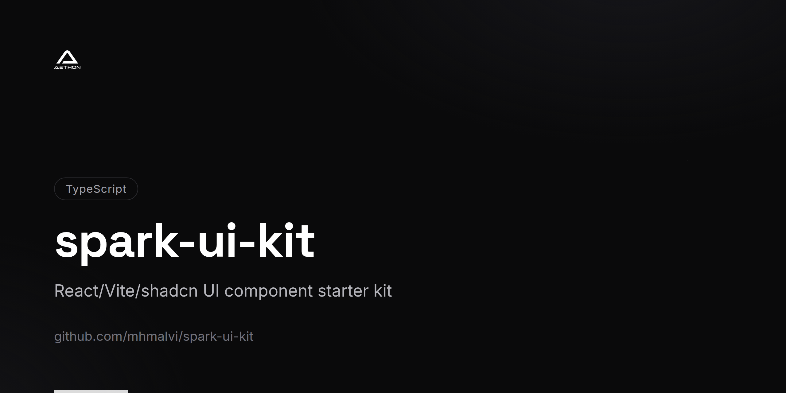
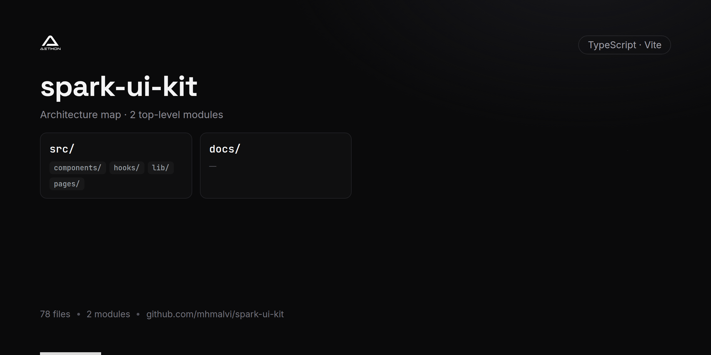

<!-- repo-card -->




# Spark UI Kit

A modern React UI starter kit built with Vite, TypeScript, and shadcn/ui components. This project provides a comprehensive collection of pre-configured UI primitives and patterns for rapidly building polished web applications.

## Tech Stack

- **React 18** with TypeScript
- **Vite** for fast development and optimized builds
- **shadcn/ui** component library (Radix UI primitives)
- **Tailwind CSS** with animations
- **React Router** for client-side routing
- **React Query** (TanStack) for data fetching
- **React Hook Form** + Zod for form handling and validation
- **Recharts** for data visualization
- **Lucide React** for icons

## Included Components

Accordion, Alert Dialog, Avatar, Checkbox, Collapsible, Context Menu, Dialog, Dropdown Menu, Hover Card, Menubar, Navigation Menu, Popover, Progress, Radio Group, Scroll Area, Select, Separator, Slider, Switch, Tabs, Toast, Toggle, Tooltip, Command (cmdk), Date Picker, Input OTP, Resizable Panels, and more.

## Getting Started

### Prerequisites

- Node.js >= 18
- npm or Bun

### Installation

```bash
# Clone the repository
git clone https://github.com/mhmalvi/spark-ui-kit.git
cd spark-ui-kit

# Install dependencies
npm install
# or
bun install
```

### Development

```bash
npm run dev
```

### Build

```bash
npm run build
```

### Preview Production Build

```bash
npm run preview
```

## Project Structure

```
spark-ui-kit/
├── public/             # Static assets
├── src/                # Application source code
├── components.json     # shadcn/ui configuration
├── tailwind.config.ts  # Tailwind CSS configuration
├── vite.config.ts      # Vite configuration
└── tsconfig.json       # TypeScript configuration
```

## License

This project is private.